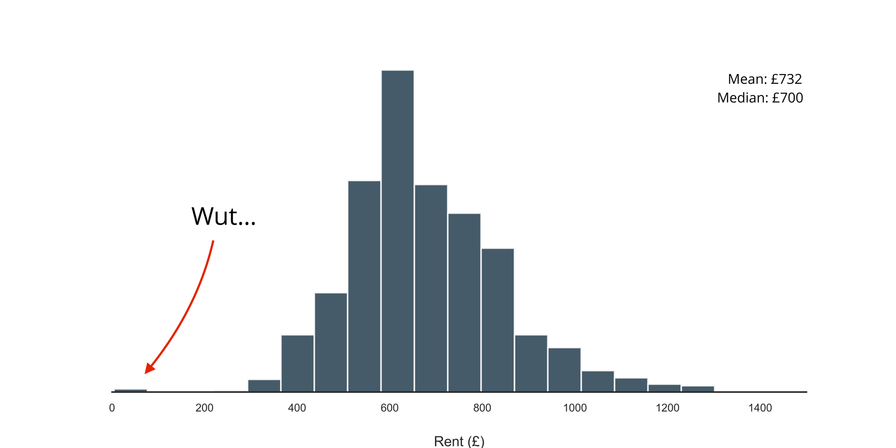
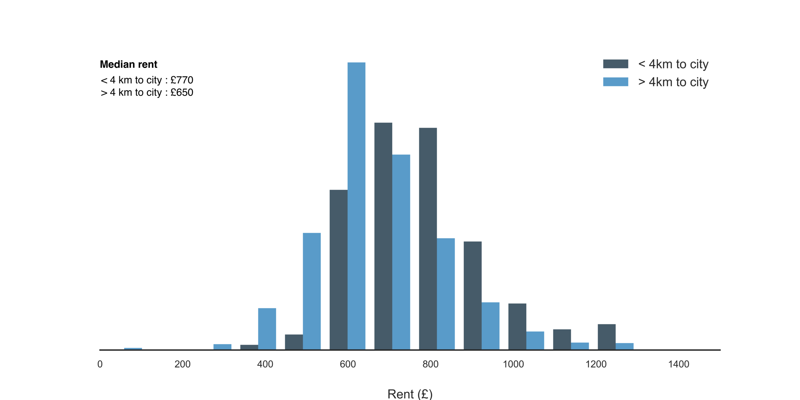
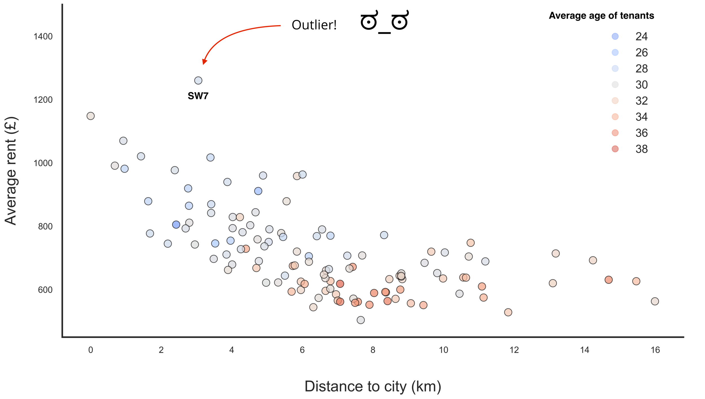
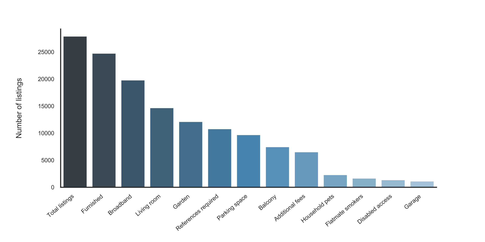
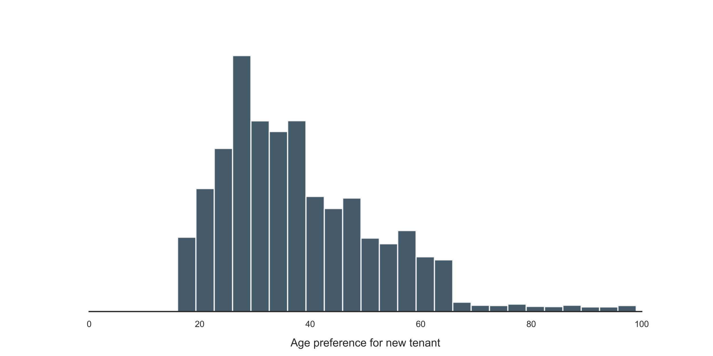
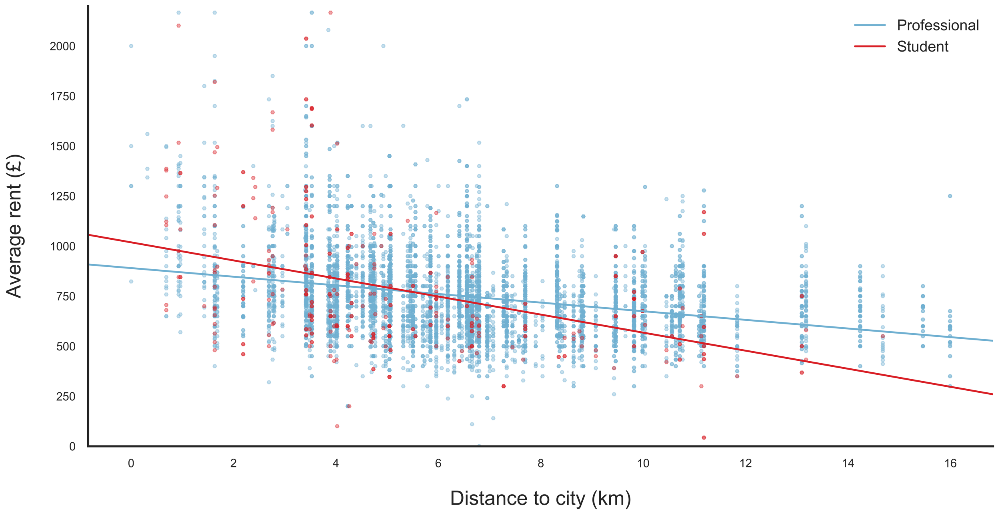
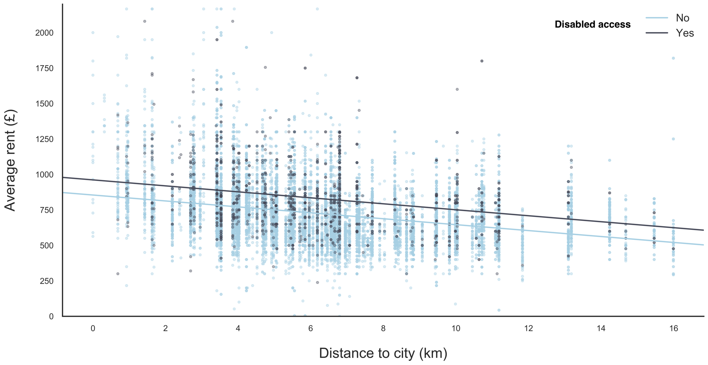

# The Numbers
<time datetime="2018-02-12 07:00">12th Feb 2018</time>

If you've ever lived in London, or been in conversation with anyone who has, there is a topic that you generally can’t avoid, which is the price of housing. In reality, to someone at my station in life, we’re actually talking about the price of renting. I'm tempted to say I would prefer to talk about the weather, except that weather-chat is already pretty well trodden in this city. I’m not sure what’s third on the list but it probably ain't much more illuminating... And to be clear, when I say the housing market is fucked, I don’t mean like “oh man the prices in Switzerland are fucked, but at least the wages are good". I mean more like "I genuinely don't understand how people could possibly sustain their life here making only minimum wage" kinda fucked.

The sad reality of living in a city like London is you pay a hell of a lot for a space to call your own. The figures get more eye-watering when you really start looking at what you’re getting for that money. Dilapidated flatshares of 5+ people, with no living room and border-line criminal estate agents are par for the course (and, also, my first rental experience here). The concept of learned helplessness is probably a very apt description this whole situation. But.. Hey, London ¯\_(ツ)_/¯

Now instead of looking on the bright-side of life, the dynamism of London, its culture, and the endless possibilities, I decided to revel in self-pity and dive in head first to get a digital perspective on this enduring topic of conversation. A handful of websites are the usual go-to resources for Londonders trying find shelter. Naturally, these domains serve as a rich source of info for some obsessive geek with a modicum of computer skills. And, as an obsessive geek with a modicum of computer skills, I have been dong just that. Over the last few weeks I've been tinkering around with Python/Beautiful Soup to scrape these websites for their troves of information. All in all I obtained information on over 27,000 rental listings with 38 data points on each one. The data includes stats such as number of bedrooms, deposit, proximity to a tube station, if there is a garden etc. etc. There's quite a bit we can explore here so I plan to spread this out over three posts. In the first, we'll focus on the heart of the matter: rental prices. I’ll start off with some basic analyses then later on we might be able to sift out some interesting nuggets. In the second part, I’m going to use some natural language processing tools to explore the titles and description of these listings, and in the third part I’m going to try to train a neural network to generate a description of a listing based on some supplied information of the flat. I have not actually started that third part as of the time of this post, so who knows if I’ll actually get that far. Only you know, reader from the future…

## Boring Basics
Well the most obvious point to start with is to actually look at the average rent in London. I'm guessing the average may actually be skewed a bit by a few outlandishly priced listings, so a median is probably a more fair bet as to what things cost. (Note: all prices are listed as per-calendar-month).

Interestingly, the general spread of prices is a bit less skewed than I was expecting. Admittedly there a handful of places well above the x-axis limits. Also, you know what, looking at those median prices.. It doesn’t sound that bad. One would be forgiven for saying that its actually.. reasonable. Oh but wait we’re including data for all nine, count them nine, transport zones (I apologise if nine doesn’t really sound like a exorbitant number. I come from a city where there are only two). Let’s look at those prices again for listings within 4 km of the city centre.

As we’d expect, higher prices being demanded closer to the centre, but the prices are still far below what I would expect. A naturally confounding factor is that closer isn’t always best. And a lot of regions which are actually quite pricey may be further out of London than you would expect. And of course, purely looking at the numbers doesn’t really provide a complete picture of the situation. As I noted, part of the pain is paying this level of rent and then walking into your flat, sighing, and looking around at the mouldy walls, the poor insulation, the cramped kitchen. Another caveat is that the sites I scraped are clearly aimed at twenty-somethings not too dissimilar from me. These are sites for the 99%. Having said all this, I surprised myself seeing these numbers. Thought they would be higher. 

Extending on the previous point of comparing rents vs. distance, we can look at the average rents for all the different postcodes in London. By working out an average distance of each postcode from the city centre, we can see the (obvious) relationship between proximity to the city and rent. This curve is not linear, so one could probably save a bit of cash by resigning themselves to a flat a few kilometres further out from the centre (which I refuse to do). Though, even if you were willing to stay 16 km out, you’re not saving much more than someone who’s at half that distance. What is odd is that older people are staying further away from the city centre. Is this the data showing their maturity and pragmatic thinking? Are we young people just schmucks paying excessive rents to be closer to our fancy cafes and trendy bars??

There is an outlier on this graph, which I have subtly highlighted. The postcode is SW7 - South Kensington, which will come to no surprise to Londonders, as it rubs shoulders with Hyde Park and Harrods. This uber expensive locale is in the Royal Borough of Kensington and Chelsea. You might remember that also within this borough was the Glenfell Tower Fire in 2017, which sparked reactions over the neglect of public housing in one of the richest Boroughs with perhaps the greatest wealth inequality in the UK. I’m not going to get into all that, though its very interesting to see this postcode top the list in my investigations.

## Flats, Flatmates and Preferences

We’ve had a brief look at flat prices, but what are these flats? What do they look like? What sort of amenities can we expect? This is broken down in the next graph.

I think this graph gives us a very clear idea of what is typical for renting in London, or perhaps what sort of demographic these websites are tailoring towards. Of all the flats for which information was gathered, the vast vast majority were furnished. If you’ve just moved to London, or you're only going to stay a few years (which covers an unexpectedly high number of professionals) why bother buying furniture? Especially if you’ve only got a 12 month lease and will be moving out again shortly. Trips to Ikea are for those with mortgages. Unfortunately, the lack of requirement for references probably doesn’t bode well for the quality of the properties advertised. Additionally, it can be seen that what might be considered basic amenities in other cities, such as gardens, balconies or even living rooms, are severely laking in this dataset. What we can take away is that the average person looking for a flat in London is actually just getting a bedroom with a bed. We can also see here that only 5.8% of flats have smokers, which is odd considering the average for London is actually about 15%. The one explanation I have for this is that there is probably a higher proportion of smokers in older demographics, who probably own their own homes, and ain’t likely to be on a site designed for twenty-somethings.

Now onto the search for potential new flatmates. For somebody who’s going to be sharing my living room, my fridge, my cupboards, my home, my TV time, I can be pretty picky about a flatmate. Thankfully the internet-gods have provided a way to discriminate against all those who might potentially mildly irritate us and hone in on acceptable candidates to pick for our flatshares. I thought it might be a little fun to poke fun at what are the preferences for potential flatmates out there in the grind of London housing. Turns out it was a slightly depressing task.. more on that below. First things first, what sort of age is most desirable for a new flatmate? Not all adverts had this preference listed, but for those that did it is clear that late-twenties to early-thirties is the sweet spot. Considering the average age of the existing tenants (in the first scatter plot) this comes as no surprise. Obviously people would want to share a flat with others of a similar age. But looking at the histogram below also reveals some interesting insights. Apparently nobody really wants to live with people under 20 (can you blame them). In fact, a tenant 50-60 yrs old is just as desirable as an 18 yr old. There is also a long tail of a small number of listings happy to take people up to 100 yrs old. I would be curious to see if these are "traditional" flatshares with some other very accepting young people, or if they are private studio apartments. 

Now let us focus our attention to those who are increasingly being treated as the scum of society and second class citizens, smokers. Eww! (Side note: if, as a society, you are going to ban a specific substance from essentially any public space, and make it socially unacceptable to do it in any remaining avenues, how about we just make the act illegal? Or, preferably, give up the facade that it isn’t hypocritical to do the same for other illicit substances /rant) But back to the point, smokers, eww. So how many other London folk feel a similar sentiment. Turns out.. a not insignificant amount.. In fact over 45% of listings give a firm NO to smokers tainting their wholesome domiciles. And if that gave you a good giggle, the next one may affect you more.. 70% of listings gave a very firm NO to couples tainting their wholesome domiciles. So I suppose we find couples more disgusting than smokers now.. ? To be serious though, all this makes sense beca…. oh wait 87% of listings gave an incredibly firm NO to pets?!? Pets don’t taint wholesome domiciles. If anything pets.. well.. what’s the opposite to taint.. Ugh Google told me ‘disinfect’ but I don’t think that sounds right. Well regardless, this is clearly a harsh injustice done on all those homeless puppies out there.

One variable that hits pretty close to home is what sort of preference is there for us poor students out there in the concrete jungle of London? 32% of listings blacklisted students from applying (which is probably understandable). Out of the 27,842 listings gathered, the majority didn’t care one way or the other. Though, only 398 listings (1.4%) specifically requested a student as the new tenant. One would naturally think that these listings are probably cheap and full of students already, thereby avoiding having to pay council tax. Though I’m not so sure…

It appears that listings with a preference for a professional occupant are slightly more expensive on average, probably because these are swankier abodes. What’s odd is that students seem to be paying more than professionals as we get closer to the city centre. Wut? I understand a simple linear regression perhaps isn't the most accurate way to demonstrate this, but it helps illuminate the information behind the nebulous blur of dots on the above graph. To follow up further, I’ve broken down the numbers into inner city listings ( < 4 km to the centre) and outer city listings. Inner city listings targeted to students were, on average, £963.99 pcm, 15.09% more than the average for their area! Listings targeted exclusively to professionals only came to £870.34. Outer city students only pay £647.36, -7.97% below the average for their area, compared to £721.14 for working professionals. So what gives? Why are students paying so much more closer to the city? How is this even sustainable?? 

 My suspicion before starting this line of inquiry was that luxury student accommodation, which is certainly more prevalent closer to the city, could skew the numbers. In fact, the second listing I randomly selected for students within 4 km to the city centre revealed this place - [Pure Student Living Highbury](http://www.purestudentliving.com/our-properties/london/highbury). I came across these sort of places myself before moving to London. If you're not willing to do your due diligence, and would prefer to have your accommodation sorted before moving into the country, such options can look appealing. But the numbers clearly demonstrate how these properties are essentially taking advantage of this naivety and desperation of students moving into the city. Or they are taking advantage of the wealth of families supporting their children studying in London. I feel pretty comfortable saying that because, when the majority of part-time jobs pay under £10/hr, a student would need to be working 20-30 hrs a week simply to be paying for their own accommodation, and thats before even considering groceries or, more importantly, booze and drugs. 

Though there are a number of variables provided with each property, a lot of these didn’t have a significant impact on the observed rental price. Even the proximity of the listing to a tube station was essentially negligible. However, I feel its important to highlight this last variable, disabled access. As seen in the barplot describing the frequency of amenities, the prevalence of disabled access in London is pretty uninspiring. I understand this is an old city, composed of tightly squeezed flats which don’t necessarily have the space or budget for elevators, but it is a little sad that only 5.6% of flats have this option for those who need it. And on top of this, those 5.6% of listings were about 11% more expensive than the flats around them. I imagine there are already enough burdens to bear living disabled in London, without limited and expensive housing needing to be added to the mix.

A brief overview of London done. I would certainly be interested in repeating this analysis at intervals in the future to see if any of these numbers get better, or get worse. In Part 2 I'll be looking at the descriptions given to these listings to see what that tells us about the flats, their tenants and the people who wrote the advertisement (spoiler: I'll be making fun of estate agents).
