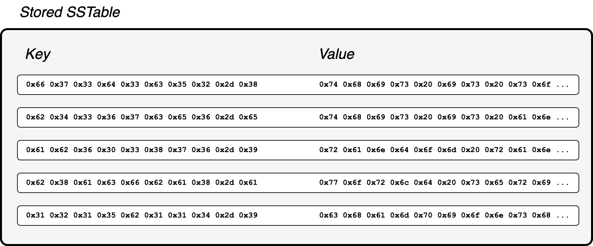

# A Simple Guide for Choosing the Right Database
<time datetime="2024-12-23 07:00">23rd Dec 2024</time>

Why would you pick PostgreSQL to support your next application when you have dozens of alternatives to choose from?

Databases are a tool to be leveraged by your application. But you should select the right tool for the job. You wouldn’t stubbornly use a hammer for every DIY project because you already know how a hammer works.

There are many articles discussing pros and cons of various databases. But so much information can be paralysing. How do you know which benefits or limitations are truly applicable to your use case? Do you even need to consider all types of databases that exist? Of course, many factors will impact why you should pick one database over another. But above all, **ask what type of data model aligns with your application**. Why? Because this is a strong indicator for how efficiently a database can organise and retrieve your data. Other technical or practical reasons can then be considered to guide the final technology choice.

If you would like to gain a better understanding of the points I raise here I would **strongly** recommend reading Designing Data-Intensive Applications by Martin Kleppmann. I reference other useful further reading at the end of the article for the eager developers out there.

## What is a data model?
A data model describes how data is structured and logically organised in a database. For example, SQL uses a relational model, where relations are stored in separate tables, which will be physically separate on disk. Others include document, column-family (or wide-column) and network data models. In certain use cases, it is also possible to effectively ignore the data model altogether!

Data models are not interchangeable. Each has assumptions about how the data is structured and will be accessed. A mismatch between the data model of your database and your application will impact performance. So, when building a new application, ask yourself these questions:
- Will the written data follow a regular schema?
- Will the data have many-to-many relations?
- Is it useful to GET or PATCH only part of the data? Or will you read and write it in full?

We will see how the answers to these questions can help guide the selection of an appropriate data model and database.

## No data model (i.e. key-value stores)
**Example databases:** Riak, RocksDB

Key-value stores offer the simplest approach to modelling data. Data exists, and is referenced by a unique key. That is pretty much it. Not all key-value stores are quite that ambivalent. Some offer slightly more query support for certain data types. But, as an oversimplification, there is no data model.

RocksDB is an extreme example of this strategy. It is a key-value store where both the key and values are arbitrary byte arrays. These are stored together in an index. The database makes no assumptions what is being stored, how it is structured, and how it might be queried. Conceptually, stored records would look like this:

This design benefits write throughput. There is only a primary index, which uses an LSM tree. As a generalisation, this append only data structure should write faster than a B-tree index. Further, the database doesn’t need to update secondary indexes on writes. It doesn’t even validate constraints or data formatting for the written value.  As a design concept, making the data in each row entirely independent of other rows simplifies partitioning the database. This can greatly improve scalability.

The flexibility of the stored value may be considered a benefit for certain use cases. But such a data agnostic approach has trade-offs that make it unsuitable for most applications. Clearly, there is no database support for joins between related data. The database is ignorant whats stored for any key. It is not even possible to to perform simple updates without first reading the value into the application code. For example, RocksDB cannot natively increment a counter or append to an array. The required Read-Modify-Write operations to update a value has obvious performance implications. It also introduces concurrency headaches if multiple threads update the same key.

When is no data model suitable for your application?
- If you need **very high** performance.
- You are dumping arbitrary data and the written records are independent from one another.
- The data will always be written and read in full during runtime.

## The document model
**Example databases:** MongoDB, CouchDB, Elasticsearch

The document model model represents data as a semi-structured object, commonly JSON or XML. This model is a more structured extension of the key-value store. There is a primary key, and the value is the semi-structured object. However, because this value can be a rich nested document, and include secondary indexes, its value is typically stored separately on disk to the indexed keys.

The document model is suitable if reading and writing self-contained data, which only has one-to-one or one-to-many relations. This allows the entire object to be stored together, in one location on disk. Consider this record for a holiday property rental (TODO: or holiday homestay) website:

Here the fields contain one-to-one and one-to-many relations. By storing the object as a single document, access to the full object is provided through a simple, efficient, atomic query. No joins necessary!

Indeed, document databases typically have weak support for joins. It is discouraged to maintain this relation through foreign keys to other document collections. The preferred approach is to denormalise the data and embed it in all the relevant primary documents. By denormalising data, we remove the impediment of document joins and improve read performance. But there are downsides. Such an approach is detrimental if we expected the embedded data to change frequently. This is because the embedded data may be duplicated across many documents. So we need to update all of these if any of the embedded data is updated. On top of the obvious performance implications, this increases the chances of storing stale data, which could introduce bugs. So, a document model is ill-suited to modelling data with many-to-many relations.

Document databases are usually schema-less, and the data can have arbitrary fields and levels of nesting. The lack of schema may be an attractive feature in some instances. However, for most applications there is an assumed schema. If it isn’t enforced by the database, it will be enforced in the application code. Martin Kleppmann refers to this as “schema on read”. As this schema evolves, the application code has to accommodate both old and new schemas of the stored data. The result can be messy and difficult to maintain code. Therefore, I don’t believe the “flexibility” of a schema-less database provides a real benefit. It’s simply a property of the database to be aware of.

When is a document data model suitable for your application?
- Your data is self-contained (only one-to-one or one-to-many relations) and is typically queried as the whole object.
- Your data truly doesn’t follow a fixed schema.

## The relational model
**Example databases:** PostgreSQL, MySQL, SQL Server

The relational model separates related data into separate tables, as opposed to storing the entire object in one location. There is less overhead if only part of the data needs to be updated or read. Less data needs to be read into the database’s memory or sent over the network. Splitting an object into multiple tables isn’t limited to many-to-many relations. It can be useful for one-to-many, and even one-to-one relations too. The best schema design depends on the use case and expected query patterns.

Unsurprisingly, the relational model is useful for data that contains many-to-many relationships. Reading such data is more efficient as relational databases have good support for joins between tables. Also, separating objects into tables normalises the data, which improves write efficiency if we need to update a relation. Unlike unnormalised document databases, now we only need to update a single record, instead of every record that references that relation. Below we see the same property listing data as before, but split into a number of different tables. These reference each other through  foreign keys.

However, these relations impact write performance. Each table has a separate index, which needs to be updated every time the table is updated. There may be many secondary indexes to aid table joins. These, too, need to be updated on table writes. The relation model also limits performance if we requently read or write the full object. Depending on the schema design, this may require the database to join multiple tables. While relational databases have good support for joins, this operation still carries a performance hit. And this cost is exacerbated for distributed databases (TODO: Is this necessary to mention?).

As relational databases improve support for JSON/XML data types, they can leverage some of the benefits of document databases. Certain fields may be defined as a schema-less JSON object, which makes it easier to evolve these as the app matures. An example is the details field in the above Listing table. Through this feature, we can gain some of the advantages of document-oriented databases.

When would your app benefit from a relational model?
- You will frequently read only slices of the data, as opposed to requiring the full object.
- Your data contains many-to-many relations. Particularly, if you expected this related data to be updated frequently.

## Deciding on a database
Again, ask yourself these questions when considering what data model, and therefore database, best suits your application.

**Will the written data follow a regular schema?**
If not, maybe a key-value store or document database could be useful. But be mindful how your application code will manage evolving data.

**Will the data have many-to-many relations?**
If the data has many-to-many relations, it is likely a relational database will serve you best. But if not, other considerations, such as your query patterns, scaling requirements, and transaction support will indicate the best option (TODO rewrite).

**Is it useful to GET or PATCH only part of the data? Or will you read and write it in full?**
A relational structure is useful if only reading or updating part of the data. The database won’t need to read in the entire object when all that is required is a single field. The APIs of many document databases will allow you to retrieve and update a slice of data, but the database itself will need to read the full object into memory. For smaller applications, this overhead probably won’t be noticeable. But it is worth considering as your application grows. And for many key-value stores, updating a slice of data isn’t possible at all. The full object will need to be updated through the application code.

I have summarised the most common data models for online transaction processing (OLTP). Only consider other options if it is obvious these are inadequate. For example, a network database would clearly manage relations between users on a social media platform better. And ridiculous scaling requirements could force you to consider models that can be better distributed. In such situations, research, research some more, and use first principles to guide your decision.

## Further reading
Here is useful reading to better understand the principles guiding different database designs. Some of this is overly academic, but will help you understand the technologies you work with every day as a developer.

[Designing Data-Intensive Applications](https://www.oreilly.com/library/view/designing-data-intensive-applications/9781491903063/) - Martin Kleppman 
[A Relational Model of Data for Large Shared Data Banks](https://www.seas.upenn.edu/~zives/03f/cis550/codd.pdf) - Edgar F. Codd 
[The Log-Structured Merge Tree - (LSM-Tree)](https://www.cs.umb.edu/~poneil/lsmtree.pdf) - Patrick O’Neil et al. 
[Dynamo: Amazon’s Highly Available Key-value Store](https://www.allthingsdistributed.com/files/amazon-dynamo-sosp2007.pdf) - Giuseppe DeCandia et al. 
[Bigtable: A Distributed Storage System for Structured Data](https://static.googleusercontent.com/media/research.google.com/en//archive/bigtable-osdi06.pdf) - Fay Chang et al. 
