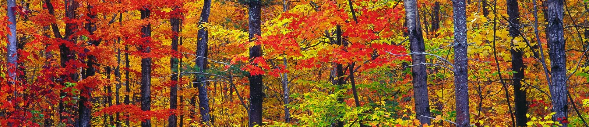

# Switching Seasons

One of my favourite periods of each year is the shift in weather found at the beginning of Spring and Autumn. There is something invigorating about change, though perhaps this is more an opinion largely held by me (and maybe explaining why I’ve lived abroad a couple of times). I know others who would prefer it to be Summer 12 months of the year. Yes, summer is more practical, and we all like some gorgeous weather, however, as I’ve written before, we quickly acclimatise to our surroundings. After 3 months of heat, a sunny day doesn’t pack quite the same punch as it did previously, leaving me wanting something a little more.. complex. 

So we are afforded two major adjustments each year, both hitting me in a different fashion. Naturally, the shift from winter into spring has an air of rejuvenation, with the sun finally peeking through the clouds and the vibrant greenery. There’s an unquestioned optimism for the future. Autumn, on the other hand, takes a different, more melancholic approach. Days are getting darker and gloomier, the colour palette expressed by the trees is depressed yet at the same time intensified, and an increasing amount of time is spent indoors. This all sounds like a downer but the feelings it evokes could be described as analogous to nostalgia. A feeling which is a paradoxical union of contentment, longing, what was and what is now. Not necessarily a negative feeling, just a bit more nuanced. And following from this, of course our associations with the seasons are inevitably impacted by the memories corresponding to these periods. To take an empirical approach, our thoughts and emotions which relate to these changes stem from the brain, but it is intriguing to delve slightly beyond the vail of mechanistic neuronal coding to another cause for this effect. 
 
The circadian rhythm is a series of hormonal responses which set our biological clock, keeping our sleep-wake cycles in near sync with the rise and fall of the sun. Even when thrown halfway across the globe, this ebb and flow of hormones is resistant to change, leading to a frustrating disconnect between our internal and external environments. Only with time does our body learn and adapt to its new surroundings. I am curious if the emotional response described in the preceding paragraphs is also somewhat rooted in a rhythmic tide of horomonal responses. These thoughts are on my mind as, having recently moved to London, I'm getting mixed signals with the most recent change of season. While the odd sunny day does pick me up as one would expect going into Spring, I feel a Autumnian slant to my disposition as of late. Am I in a more abstract form of jet lag, with my body primed to expect a shift to gloomier weather in the near future? Is there a biological foundation for this fact, in which such a response could be kept in check over the course of an entire year? Such effects are present in nature, as evidenced by seasonal hibernation or migration of species. To be sure, seasonal affective disorder is a real and documented condition, whereby decreases in sunlight can alter melatonin and serotonin levels, eliciting depressive symptoms. However, such an acute effect is at ends with the enduring rhythmic response I describe. Though.. perhaps it's the general dreariness of English weather merely throwing my senses a curveball, the trajectory of which my stagnant mind cannot yet correct for. 